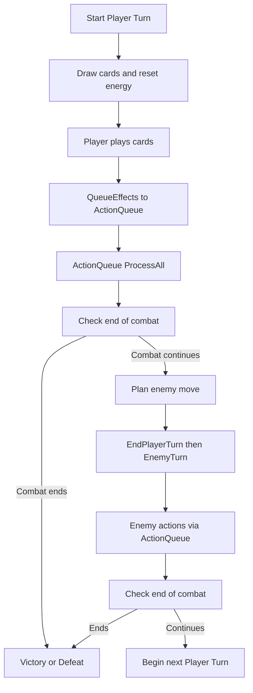
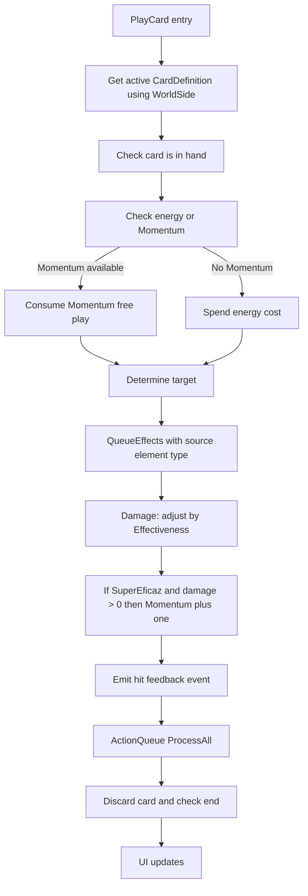

## Combat Architecture

### Big picture
- Combate 1v1 por turnos: el jugador juega cartas, se encolan acciones y se resuelven en orden.
- Conceptos clave:
  - World A/B (Change World): estado binario que afecta cartas duales; limitado a 1 cambio por combate (debug ilimitado opcional).
  - ElementType (placeholder por color) + Effectiveness: modifica daño (SuperEficaz/PocoEficaz/Neutro).
  - Momentum: free play al golpear debilidad (SuperEficaz); se consume en el siguiente uso de carta para no gastar energía.
  - ActionQueue / IGameAction: cola determinista que resuelve acciones (daño, block, draw) secuencialmente.

### Diagramas (Mermaid)

#### Turno del jugador (alto nivel)

#### PlayCard (detalle)

### Where to look (rutas)
- Turnos / cambio de mundo / momentum / efectividad:
  - `Assets/Scripts/Gameplay/Combat/TurnManager.cs`
- HUD, popups WEAK/RESIST/MOMENTUM, botón Change World:
  - `Assets/Scripts/Gameplay/Combat/CombatUIController.cs`
- Cola de acciones y tipos de acciones:
  - `Assets/Scripts/Gameplay/Combat/ActionQueue.cs`
  - `Assets/Scripts/Gameplay/Combat/Actions/*`
- Tipos y tabla de efectividad:
  - `Assets/Scripts/Gameplay/Combat/ElementTypes.cs`
- Datos de cartas:
  - `Assets/Scripts/Gameplay/Cards/CardDefinition.cs`
  - `Assets/Scripts/Gameplay/Cards/DualCardDefinition.cs`
  - `Assets/Scripts/Gameplay/Cards/CardDeckEntry.cs`
- Datos de enemigos:
  - `Assets/Scripts/Gameplay/Enemies/EnemyDefinition.cs`
  - `Assets/Scripts/Gameplay/Enemies/EnemyMove.cs`

### Notas de diseño
- ElementType por color es placeholder; se renombrará a tipos finales más adelante.
- “Momentum” es el nombre visible; internamente se usa contador de free plays (`FreePlays`).
- Cambio de mundo: 1 uso por combate; flag de debug permite ilimitado.
- UI se construye en runtime por `CombatUIController`; sprites de avatares se configuran vía inspector/captura inicial.

### Troubleshooting
- No aparecen tests en Test Runner:
  - Verifica asmdefs: runtime (`Assets/Scripts/RoguelikeCardBattler.asmdef`) y tests (`Assets/Tests/EditMode/EditModeTests.asmdef`). Usa pestaña EditMode en `Window > General > Test Runner`.
- Sprites/avatares no se ven:
  - `CombatUIController` reconstruye la UI; asigna sprites en inspector y se capturan al iniciar. Revisa que haya sprite asignado en PlayerAvatar/EnemyAvatar o en los campos del controller.
- No sale WEAK/RESIST/MOMENTUM +1:
  - Evento `PlayerHitEffectiveness` se emite en `TurnManager.AdjustDamageForEffectiveness`; asegúrate de tener tipos asignados en carta y enemigo, y que el golpe sea SuperEficaz/PocoEficaz.

