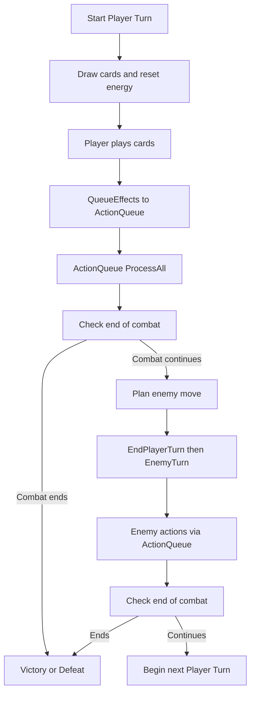
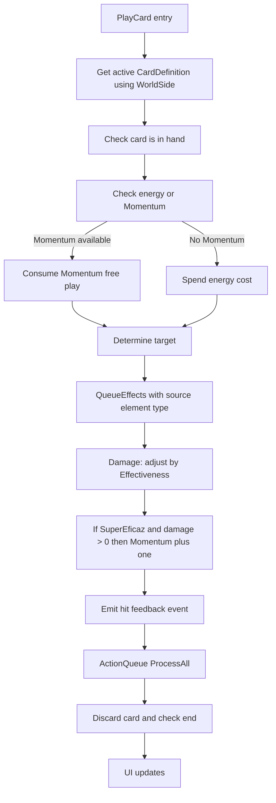

## Combat Architecture

### Big picture
- Combate 1v1 por turnos: el jugador juega cartas, se encolan acciones y se resuelven en orden.
- Conceptos clave:
  - World A/B (Change World): estado binario que afecta cartas duales; limitado a 1 cambio por combate (debug ilimitado opcional).
  - ElementType (placeholder por color) + Effectiveness: modifica daño (SuperEficaz/PocoEficaz/Neutro).
  - Momentum: free play al golpear debilidad (SuperEficaz); se consume en el siguiente uso de carta para no gastar energía.
  - ActionQueue / IGameAction: cola determinista que resuelve acciones (daño, block, draw) secuencialmente.

### Diagramas (Mermaid)

#### Turno del jugador (alto nivel)

```mermaid
flowchart TD
    A["Start Player Turn"] --> B["Draw cards and reset energy"]
    B --> C["Player plays cards"]
    C --> D["QueueEffects to ActionQueue"]
    D --> E["ActionQueue ProcessAll"]
    E --> F["Check end of combat"]
    F -->|Combat ends| G["Victory or Defeat"]
    F -->|Combat continues| H["Plan enemy move"]
    H --> I["EndPlayerTurn then EnemyTurn"]
    I --> J["Enemy actions via ActionQueue"]
    J --> K["Check end of combat"]
    K -->|Ends| G
    K -->|Continues| L["Begin next Player Turn"]
```

#### PlayCard (detalle)

```mermaid
flowchart TD
    A["PlayCard entry"] --> B["Get active CardDefinition using WorldSide"]
    B --> C["Check card is in hand"]
    C --> D["Check energy or Momentum"]
    D -->|Momentum available| E["Consume Momentum free play"]
    D -->|No Momentum| F["Spend energy cost"]
    E --> G["Determine target"]
    F --> G
    G --> H["QueueEffects with source element type"]
    H --> I["Damage: adjust by Effectiveness"]
    I --> J["If SuperEficaz and damage > 0 then Momentum plus one"]
    J --> K["Emit hit feedback event"]
    K --> L["ActionQueue ProcessAll"]
    L --> M["Discard card and check end"]
    M --> N["UI updates"]
```

### Where to look (rutas)
- Turnos / cambio de mundo / momentum / efectividad:
  - `Assets/Scripts/Gameplay/Combat/TurnManager.cs`
- HUD, popups WEAK/RESIST/MOMENTUM, botón Change World:
  - `Assets/Scripts/Gameplay/Combat/CombatUIController.cs`
- Cola de acciones y tipos de acciones:
  - `Assets/Scripts/Gameplay/Combat/ActionQueue.cs`
  - `Assets/Scripts/Gameplay/Combat/Actions/*`
- Tipos y tabla de efectividad:
  - `Assets/Scripts/Gameplay/Combat/ElementTypes.cs`
- Datos de cartas:
  - `Assets/Scripts/Gameplay/Cards/CardDefinition.cs`
  - `Assets/Scripts/Gameplay/Cards/DualCardDefinition.cs`
  - `Assets/Scripts/Gameplay/Cards/CardDeckEntry.cs`
- Datos de enemigos:
  - `Assets/Scripts/Gameplay/Enemies/EnemyDefinition.cs`
  - `Assets/Scripts/Gameplay/Enemies/EnemyMove.cs`

### Notas de diseño
- ElementType por color es placeholder; se renombrará a tipos finales más adelante.
- “Momentum” es el nombre visible; internamente se usa contador de free plays (`FreePlays`).
- Cambio de mundo: 1 uso por combate; flag de debug permite ilimitado.
- UI se construye en runtime por `CombatUIController`; sprites de avatares se configuran vía inspector/captura inicial.

### CombatUIController — Plan de descomposicion

`CombatUIController.cs` es un monolito de 1400+ lineas con 5 responsabilidades mezcladas.
Se descompone incrementalmente en componentes independientes, cada uno un MonoBehaviour
que se suscribe a eventos de TurnManager y recibe referencias de UI necesarias.

**Acoplamiento clave**: BattleFlowController NO referencia CombatUIController. Ambos
se conectan a TurnManager de forma independiente. Esto permite extraer componentes
sin tocar BattleFlowController.

#### Componentes objetivo (en orden de extraccion)

| Componente | Responsabilidad | Dependencias | Estado |
|------------|----------------|--------------|--------|
| `CombatFeedbackView` | Popups WEAK/RESIST/MOMENTUM, enemy shake, victory/defeat text, hand limit toast, panel flash | TurnManager events, UIAnimationHelper, AudioManager | **Fase 1** |
| `CardHandView` | Mano de cartas, CardButtonBinding, sync, layout adaptivo, click → TurnManager | TurnManager (card play API), UI builders | Fase 2 |
| `CombatHudView` | Paneles de HP, energia, momentum, mundo, block overlays, intents | TurnManager (read state), UI builders | Fase 3 |
| `CombatBackgroundView` | Fondos sky/ground por mundo, CoverFill, sprites A/B | TurnManager.CurrentWorld | Fase 4 |

#### Patron de integracion

Cada componente extraido:
1. Vive en el mismo GameObject que CombatUIController (o hijo directo).
2. Se suscribe a TurnManager events en OnEnable/OnDisable.
3. Recibe referencias de UI via campos internos (no SerializeField).
4. CombatUIController le pasa las referencias despues de BuildUI() via metodo `Initialize()`.
5. Es **solo presentacion** — nunca muta estado de gameplay.

#### Reglas de extraccion

- Cada fase es un commit/PR independiente.
- Despues de cada fase: zero console errors + gameplay funcional = criterio de aceptacion.
- CombatUIController se adelgaza pero sigue siendo el orquestador de BuildUI().
- Los UI builder helpers (CreatePanel, CreateText, etc.) permanecen en CombatUIController
  hasta que se extraigan todos los componentes; luego se mueven a un utility compartido.

### Troubleshooting
- No aparecen tests en Test Runner:
  - Verifica asmdefs: runtime (`Assets/Scripts/RoguelikeCardBattler.asmdef`) y tests (`Assets/Tests/EditMode/EditModeTests.asmdef`). Usa pestaña EditMode en `Window > General > Test Runner`.
- Sprites/avatares no se ven:
  - `CombatUIController` reconstruye la UI; asigna sprites en inspector y se capturan al iniciar. Revisa que haya sprite asignado en PlayerAvatar/EnemyAvatar o en los campos del controller.
- No sale WEAK/RESIST/MOMENTUM +1:
  - Evento `PlayerHitEffectiveness` se emite en `TurnManager.AdjustDamageForEffectiveness`; asegúrate de tener tipos asignados en carta y enemigo, y que el golpe sea SuperEficaz/PocoEficaz.

