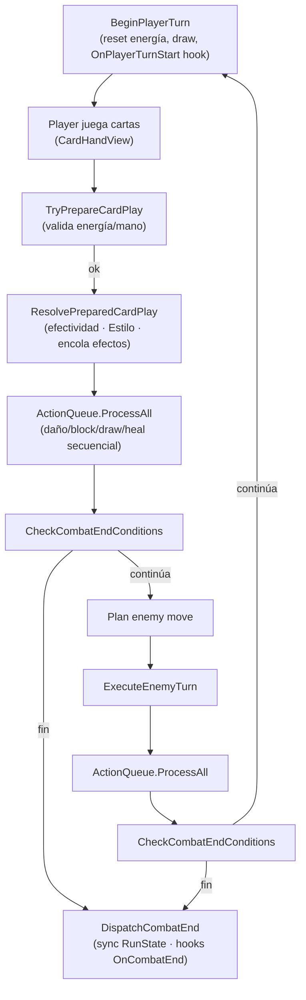
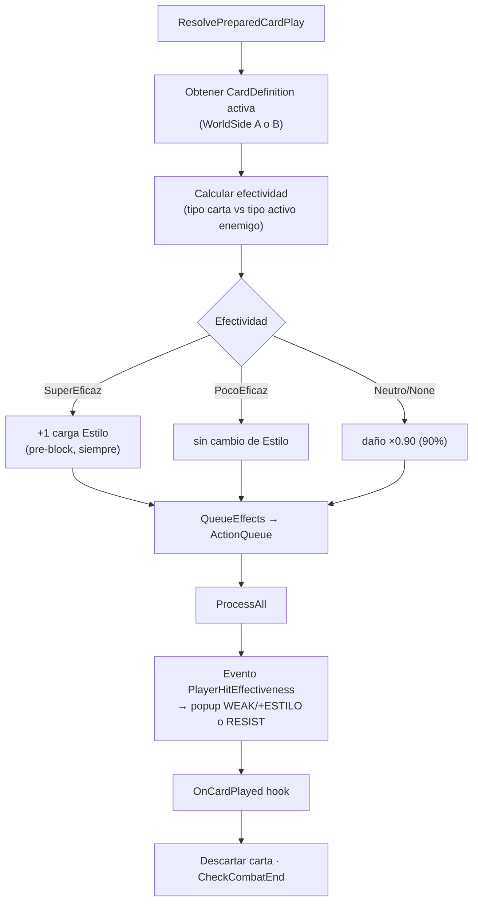

## Combat Architecture

> **Última actualización:** 2026-06-15 (SUB-PR 3 auditoría pre-M4 — paquete docs i).
> Reescrito con Contador de Estilo (M2, reemplaza Momentum) + subsistemas M2/M3 +
> pipeline fin-de-combate (Opción B, fix 2026-06-14).

---

### Big picture

Combate 1v1 por turnos: el jugador juega cartas, las acciones se encolan y se
resuelven en orden determinista.

**Conceptos clave:**

- **World A / B (Change World):** estado binario que afecta el lado activo de las
  cartas duales y el tipo elemental del jugador. Limitado a 1 cambio por combate
  (configurable; debug ilimitado opcional).
- **ElementType** (placeholder por color: Rojo, Amarillo, Azul, Morado, Negro,
  Blanco, None) + **Efectividad**: modifica daño (SuperEficaz ×1.5 / Neutro ×1.0 /
  PocoEficaz ×0.75). **Bidireccional desde M2 (DD-018):** aplica al daño del jugador
  sobre el enemigo Y al daño del enemigo sobre el jugador.
- **Contador de Estilo:** +1 carga al hacer un golpe SuperEficaz (pre-block; el
  bloqueo del enemigo no anula la carga); −1 al recibir SuperEficaz del enemigo.
  5 cargas → 1 switch de mundo extra (no acumulable), reset de cargas. HUD: "Estilo: X/5".
- **Cartas neutras:** daño al 90% del base (regla de balance, sin popup de efectividad).
- **ActionQueue / IGameAction:** cola FIFO determinista que resuelve acciones
  (daño, block, draw, heal) secuencialmente. `ProcessAll()` es síncrono.
- **Retazos (M3):** items persistentes del run. `RelicHookDispatcher` invoca efectos
  en 9 eventos clave del combate/nodo vía `RelicHookContext` (API limitada de 7
  métodos). Los efectos no accedan directamente al `TurnManager`; lo hacen solo
  a través de la API del contexto.

---

### Flujo de combate — detalle

#### Inicialización

```
[BattleFlowController.Awake]
    └─ TryConfigureCombat()
          ├─ Lee RunSession + nodo actual (enemigo, IsElite, IsBoss)
          └─ TurnManager.ConfigureCombat(deck, enemy, hp, maxHp)
                ├─ Inyecta tipos por mundo del jugador
                ├─ Inicializa _player / _enemy / _actionQueue
                └─ Dispara OnCombatStart hook

[CombatUIController.Start]
    └─ BuildUI() — construye canvas en runtime (HUD, paneles, fondos)
    └─ InitializeExtractedViews()
          ├─ CombatFeedbackView — popups WEAK/RESIST/+ESTILO, shake, victory/defeat
          ├─ CardHandView — mano, click → TryPrepareCardPlay/ResolvePreparedCardPlay
          ├─ CombatHudView — textos: energía, Estilo, HP, bloqueo, intent, mundo, tipo
          └─ CombatBackgroundView — fondos A/B, CoverFill
```

#### Loop de combate

**Turno del jugador:**

1. `TurnManager.BeginPlayerTurn()` — reset energía, draw cards, dispara `OnPlayerTurnStart` hook.
2. `CardHandView` muestra la mano. Click → `TryPrepareCardPlay(entry, out prepared)`:
   - Valida energía y que la carta esté en mano.
   - Devuelve un `PreparedCardPlay` con la definición activa y el target.
3. Animación de ataque (`PlayAttackOnce`). Al completar → `ResolvePreparedCardPlay(prepared)`:
   - Determina efectividad (atacante vs tipo activo del enemigo).
   - Actualiza Contador de Estilo (±1).
   - Encola efectos en `ActionQueue`.
   - `ActionQueue.ProcessAll()` resuelve daño/block/draw secuencialmente.
   - Dispara hooks: `OnCardPlayed`, `OnDamageDealt`/`OnDamageTaken`.
   - Descarta carta; verifica condición de fin de combate.
4. `Player.EndTurn()` → paso al turno del enemigo.

**Turno del enemigo:**

1. `TurnManager.ExecuteEnemyTurn()` — limpia bloqueo enemigo, `SelectEnemyMove()` elige movimiento
   según `AIPattern` (RandomWeighted / Sequence / PhaseBased por rango de HP).
2. Encola efectos del movimiento → `ActionQueue.ProcessAll()`.
3. `PlanNextEnemyMove()` para mostrar intent en el próximo turno.
4. Verifica condición de fin de combate.

#### Fin de combate

```
TurnManager.CheckCombatEndConditions()
    └─ TurnManager.DispatchCombatEnd()
          ├─ Sincroniza RunState.PlayerCurrentHP/MaxHP = _player.* (ANTES del dispatch)
          │   → RunState autoritativo; Retazos OnCombatEnd leen/mutan HP fresco
          └─ RelicHookDispatcher.Dispatch(OnCombatEnd, CombatEndHookData)

BattleFlowController.Update() detecta cambio de fase (Victory/Defeat)
    └─ ReportOutcome()
          ├─ ApplyCombatResult(session, victory) — flags, ActoCompleted, drops de Retazos
          │   SIN re-pisar HP (TurnManager ya sincronizó)
          └─ RunScene → SceneTransitionManager
```

> **Regla de autoría para Retazos `OnCombatEnd`:** la mutación directa de
> `RunState.PlayerCurrentHP` en OnCombatEnd ES CORRECTA bajo este diseño (Opción B,
> fix 2026-06-14). `GrantHeal` sobre el actor no es viable en OnCombatEnd (no-op:
> `IsCombatFinished` ya es `true`).

---

### Diagramas (Mermaid)

#### Turno del jugador (alto nivel)


```mermaid
flowchart TD
    A["BeginPlayerTurn\n(reset energía, draw, OnPlayerTurnStart hook)"] --> B["Player juega cartas\n(CardHandView)"]
    B --> C["TryPrepareCardPlay\n(valida energía/mano)"]
    C -->|ok| D["ResolvePreparedCardPlay\n(efectividad · Estilo · encola efectos)"]
    D --> E["ActionQueue.ProcessAll\n(daño/block/draw/heal secuencial)"]
    E --> F["CheckCombatEndConditions"]
    F -->|fin| G["DispatchCombatEnd\n(sync RunState · hooks OnCombatEnd)"]
    F -->|continúa| H["Plan enemy move"]
    H --> I["ExecuteEnemyTurn"]
    I --> J["ActionQueue.ProcessAll"]
    J --> K["CheckCombatEndConditions"]
    K -->|fin| G
    K -->|continúa| A
```

#### ResolvePreparedCardPlay (detalle)


```mermaid
flowchart TD
    A["ResolvePreparedCardPlay"] --> B["Obtener CardDefinition activa\n(WorldSide A o B)"]
    B --> C["Calcular efectividad\n(tipo carta vs tipo activo enemigo)"]
    C --> D{Efectividad}
    D -->|SuperEficaz| E["+1 carga Estilo\n(pre-block, siempre)"]
    D -->|PocoEficaz| F["sin cambio de Estilo"]
    D -->|Neutro/None| G["daño ×0.90 (90%)"]
    E --> H["QueueEffects → ActionQueue"]
    F --> H
    G --> H
    H --> I["ProcessAll"]
    I --> J["Evento PlayerHitEffectiveness\n→ popup WEAK/+ESTILO o RESIST"]
    J --> K["OnCardPlayed hook"]
    K --> L["Descartar carta · CheckCombatEnd"]
```

---

### Subsistemas M2 / M3

#### Contador de Estilo (M2, PR #89)

- Reemplaza por completo a Momentum (eliminado en M2).
- Variables: `_styleCharges` (0-5) y `_bonusWorldSwitches` (0-1, no acumulable).
- `IncrementStyleCharges()` (método interno) es la única fuente de mutación del contador.
- Al recibir SuperEficaz del enemigo: −1 carga (puede ir a negativo transitorio,
  pero no acumula bonus).
- La UI hardcodea "/5" porque `MaxStyleCharges` no está expuesto como propiedad
  pública (gap conocido, ver Future work).

#### Efectividad bidireccional (M2, DD-018)

El daño del enemigo sobre el jugador aplica el mismo multiplicador (×1.5 SuperEficaz,
×0.75 PocoEficaz) basado en el tipo del enemigo vs el **tipo activo del jugador**
(que depende del mundo actual). Las cargas de Estilo se enlazan al lado defensivo:
recibir SuperEficaz descuenta 1 carga.

#### HealAction (M2 Sub-PR D)

`EffectType.Heal` produce una `HealAction` que implementa `IGameAction`. Funciona
en ambos actores (`PlayerCombatActor.Heal()` / `EnemyCombatActor.Heal()`). El intent
`CalculateIntentValue` cubre `Defend + Heal` además de `Attack + Damage` y `Defend + Block`.

#### PhaseBased AI (M2 Sub-PR D)

`AIPattern.PhaseBased` en `EnemyDefinition`. `SelectEnemyMove()` filtra moves por
`MinHpPercent`/`MaxHpPercent` del HP actual del enemigo; si ningún rango cubre,
usa todos los moves como fallback.

#### Sistema de Retazos (M3)

`RelicHookDispatcher` — bus pub/sub instanciado en `RunSession.Awake` (persiste
con el run). `TurnManager` lo invoca en 9 eventos:

| Hook | Cuándo se dispara |
|------|-------------------|
| `OnCombatStart` | Tras `ConfigureCombat`, antes del primer turno |
| `OnPlayerTurnStart` | Al inicio de cada turno del jugador |
| `OnCardPlayed` | Dentro de `ResolvePreparedCardPlay`, tras `ProcessAll` |
| `OnDamageDealt` | Daño jugador→enemigo (incluye cartas neutras: 8º dispatch) |
| `OnDamageTaken` | Daño enemigo→jugador |
| `OnWorldSwitch` | Al cambiar de mundo (incluye cambios por Contador de Estilo) |
| `OnCombatEnd` | Tras sincronizar RunState, antes de pasar a BattleFlowController |
| `OnCampfireOptionsBuilt` | Al abrir la Hoguera (payload con Options mutable) |
| `OnShopStockBuilt` | Al armar el stock de la Tienda (payload con Stock mutable) |

`RelicHookContext` expone 7 métodos seguros: `GrantBlock`, `GrantHeal`,
`GrantDrawCards`, `GrantEnergy`, `GrantStyleCharge`, `GrantBonusWorldSwitch`,
`EnqueueExtraDamage`. Guards de `IsCombatFinished` protegen los métodos que
encolan acciones.

> **Nota de orden:** `OnPlayerTurnStart` se dispara ANTES que `OnCombatStart`
> cuando un Retazo reacciona al inicio del primer turno — footgun documentado
> para autores de Retazos futuros.

---

### Where to look (rutas)

| Qué necesitás | Dónde mirar |
|---------------|-------------|
| Turnos, cambio de mundo, Contador de Estilo, efectividad, IA | `Assets/Scripts/Gameplay/Combat/TurnManager.cs` |
| HUD (energía, Estilo, HP, bloqueo, intent, tipo, mundo) | `Assets/Scripts/Gameplay/Combat/CombatHudView.cs` |
| Popups WEAK/RESIST/+ESTILO, shake, victory/defeat | `Assets/Scripts/Gameplay/Combat/CombatFeedbackView.cs` |
| Mano de cartas, click → jugar | `Assets/Scripts/Gameplay/Combat/CardHandView.cs` |
| Fondos A/B por mundo, CoverFill | `Assets/Scripts/Gameplay/Combat/CombatBackgroundView.cs` |
| Cola de acciones y tipos de acciones | `Assets/Scripts/Gameplay/Combat/ActionQueue.cs` |
| | `Assets/Scripts/Gameplay/Combat/Actions/` |
| Tipos y tabla de efectividad | `Assets/Scripts/Gameplay/Combat/ElementTypes.cs` |
| Colores por tipo (tinte UI) | `Assets/Scripts/Gameplay/Combat/ElementTypeColors.cs` |
| Datos de cartas | `Assets/Scripts/Gameplay/Cards/CardDefinition.cs` |
| | `Assets/Scripts/Gameplay/Cards/DualCardDefinition.cs` |
| | `Assets/Scripts/Gameplay/Cards/CardDeckEntry.cs` |
| Datos de enemigos (SO, moves, AIPattern) | `Assets/Scripts/Gameplay/Enemies/EnemyDefinition.cs` |
| | `Assets/Scripts/Gameplay/Enemies/EnemyMove.cs` |
| Sistema de Retazos (hooks, dispatcher, contexto) | `Assets/Scripts/Gameplay/Relics/` |
| Flujo del run, nodos, tienda, hoguera | `Assets/Scripts/Run/RunFlowController.cs` |
| Estado del run (mazo, HP, gold, Retazos) | `Assets/Scripts/Run/RunState.cs` |
| Flujo de BattleScene, drops, ReportOutcome | `Assets/Scripts/Run/BattleFlowController.cs` |

---

### Componentes de UI de combate

`CombatUIController` es el orquestador de BuildUI + lifecycle (~710 LOC). La
presentación se distribuye en 4 componentes independientes extraídos:

| Componente | Responsabilidad | Estado |
|---|---|---|
| `CombatFeedbackView` | Popups WEAK/RESIST/+ESTILO, shake de enemigo, texto victory/defeat, flash de panel, toast de mano llena | ✓ Fase 1 |
| `CardHandView` | Botones de carta, click → TryPrepare/Resolve, animación de ataque, layout adaptivo, fade-in escalonado | ✓ Fase 2 |
| `CombatHudView` | Textos de energía/Estilo/HP/bloqueo/intent/mundo/tipo, botones End Turn / Change World, highlight de avatares | ✓ Fase 3 |
| `CombatBackgroundView` | Fondos sky/ground por mundo A/B, CoverFill, polling autónomo de `CurrentWorld` | ✓ Fase 4 |

**Patrón de integración:** cada componente vive como MonoBehaviour en el mismo
GameObject que CombatUIController (o hijo directo). Recibe referencias de UI
vía `Initialize()` después de `BuildUI()`. Se suscribe/desuscribe a eventos de
TurnManager en `OnEnable`/`OnDisable`. Es solo presentación — nunca muta gameplay state.

---

### Troubleshooting

- **No aparecen tests en Test Runner:**
  - Verificá asmdefs: runtime (`Assets/Scripts/RoguelikeCardBattler.asmdef`) y
    tests (`Assets/Tests/EditMode/EditModeTests.asmdef`). Usá pestaña EditMode en
    `Window > General > Test Runner`.
- **Sprites/avatares no se ven:**
  - `CombatUIController` reconstruye la UI; asigná sprites en el inspector y se
    capturan al iniciar. Revisá campos `PlayerAvatar`/`EnemyAvatar`.
- **No sale WEAK/RESIST/+ESTILO:**
  - `PlayerHitEffectiveness` se emite en `TurnManager.AdjustDamageForEffectiveness`;
    asegurate de tener tipos asignados en carta y enemigo, y que el golpe sea
    SuperEficaz/PocoEficaz (None/None es Neutro, sin popup).
- **Retazo de curación no aplica al final del combate:**
  - Verificar que el Retazo mute `RunState.PlayerCurrentHP` directamente en
    OnCombatEnd (patrón correcto). `GrantHeal` en OnCombatEnd es no-op porque
    `IsCombatFinished == true` cuando dispara el hook.

---

### Notas de diseño

- ElementType por color es placeholder; se renombrará a tipos finales más adelante.
- **Contador de Estilo** es el nombre del sistema (HUD: "Estilo: X/5"). Momentum y
  FreePlays fueron eliminados completamente en M2 (PR #89).
- Cambio de mundo: 1 uso por combate (configurable, debug ilimitado); el Contador de
  Estilo puede otorgar 1 uso extra al llegar a 5 cargas.
- UI se construye en runtime por `CombatUIController`; no hay prefabs de Canvas.
